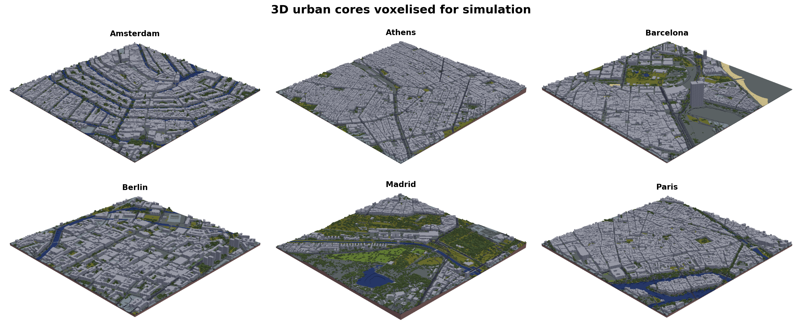
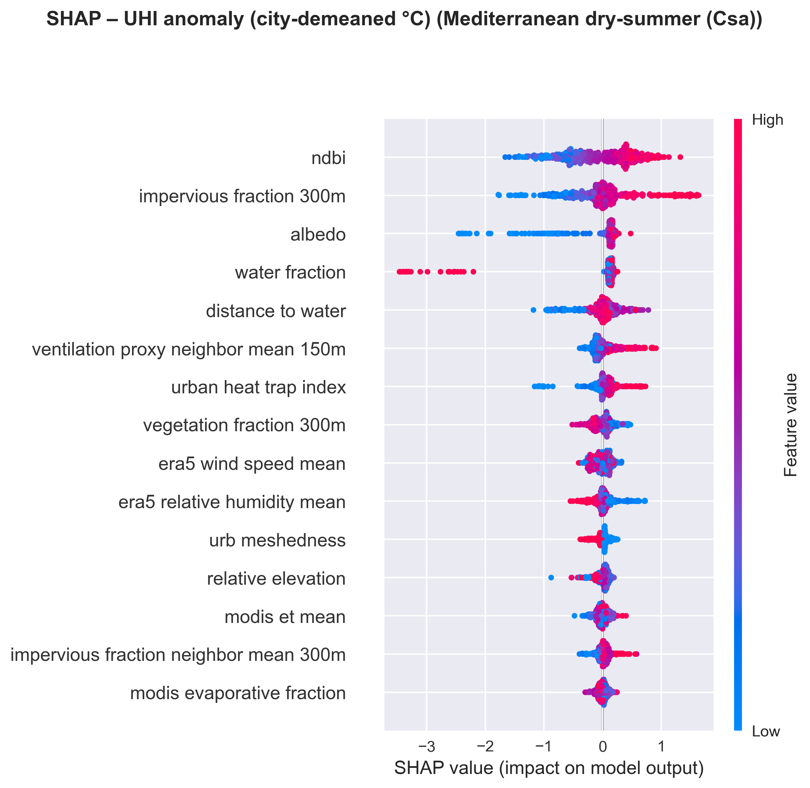

<!-- _class: lead -->
<!-- _backgroundColor: #16213e -->
<!-- _color: #ffffff -->

# Shaping Cool Cities

### Urban AI for Heat-Resilient European Cities

**Gerardo Ezequiel Martin Carreno**
MSc Urban Spatial Science — UCL CASA

UrbanAI | 2026

---

<!-- Slide 2: The Hook -->

# 61,000

Deaths from heat across Europe.
One summer. 2022.

 

> The deadliest natural hazard in European history — yet cities had more climate data than ever before.

Ballester et al. (2023) Nature Medicine

---

<!-- Slide 3: The Paradox -->

# The Translation Gap

Cities have **never had more data** about urban heat.

Yet they remain **unable to act** on it effectively.

 

| What we have | What we lack |
|---|---|
| Metre-scale satellite thermal data | Guidance on where to intervene |
| 3D building models | Understanding of why heat concentrates |
| Street-level imagery | Evidence for what actually works |

---

<!-- Slide 4: Three Gaps -->

# Three Gaps Preventing Action

**Integration** — Studies examine morphology, vegetation, or networks in isolation. Heat emerges from their interactions.

**Transferability** — What works in Berlin may fail in Barcelona. Climate context shapes everything.

**Action** — ML models predict well but explain poorly. Planners need to know *why*, not just *where*.

---

<!-- Slide 5: Research Questions -->

# Research Questions

**RQ1: What drives urban heat?**
Which urban features best predict heat risk, and how do these relationships vary across climatic contexts?

 

**RQ2: Where should cities intervene?**
Where should cooling interventions be prioritised to maximise temperature reduction while addressing demographic vulnerability?

---

<!-- Slide 6: Study Domain -->

# Six Cities, Three Climates

**Oceanic** — Amsterdam, Berlin, Paris
**Mediterranean** — Athens, Barcelona, Madrid

40,344 grid cells at 30m resolution
~6 km² per city

---

<!-- Slide 7: Data Integration -->

# Five Data Sources, One Framework

1. **EUBUCCO** — 3D building morphology
2. **GlobalStreetscapes** — Pedestrian-level vegetation
3. **Urbanity** — Street network topology
4. **Google Earth Engine** — Satellite thermal indices
5. **VoxCity** — 3D ray-tracing & solar simulation

118 features engineered from 5 complementary sources

---

<!-- Slide 8: 3D Urban Models -->

# Seeing Cities in 3D

---

<!-- Slide 9: Method -->

# From Prediction to Prescription

**Diagnosis** — XGBoost regression predicts temperature anomalies (R² = 0.841)

**Detection** — Hotspot classification identifies intervention zones

**Prescription** — 648 intervention scenarios evaluated for cooling effectiveness

 

Interpretability via **SHAP** — every prediction decomposed into feature contributions

---

<!-- Slide 10: Model Performance -->

# Predicting Heat Across Contexts

| City | R² | RMSE |
|---|---|---|
| Paris | 0.932 | 0.51°C |
| Barcelona | 0.926 | 0.84°C |
| Amsterdam | 0.880 | 0.61°C |
| Athens | 0.730 | 0.68°C |
| Berlin | 0.727 | 0.68°C |
| Madrid | 0.718 | 1.58°C |

Hierarchical climate-zone blending improves on global model for all cities.

---

<!-- Slide 11: The Surprise — SHAP -->

# What Actually Drives Urban Heat?

**Surface characteristics** — 21%
**Water features** — 13.2%
**Vegetation** — 7.0%

De-sealing matters **3x more** than tree planting.

---

<!-- Slide 12: Climate Matters -->

# Geography Changes Everything

**Continental cities** (Paris, Berlin)
→ Impervious surface dominates
→ Centre-periphery heat gradients

**Mediterranean cities** (Athens, Barcelona)
→ Topography overwhelms morphology
→ Fragmented heat patterns

**Maritime canal cities** (Amsterdam)
→ Water saturation creates ceiling effects
→ Building density becomes primary driver

---

<!-- Slide 13: The Threshold -->

# The 50% Regime Boundary

All optimal cooling strategies converge on **50% de-sealing**.

Below 50% sealed surfaces, evaporative cooling pathways become viable — a **regime transition**.

 

| Strategy | Depaving | Trees | Cooling |
|---|---|---|---|
| Maximum impact | 50% | +50% | −1.27°C |
| **Cost-effective** | **50%** | **+20%** | **−1.20°C** |

**95% of maximum cooling** with **60% fewer resources**.

---

<!-- Slide 14: Priority Zones -->

# Where to Intervene First

Composite scoring:
- Heat risk (40%)
- Demographic vulnerability (35%)
- Cooling potential (25%)

Priority zones: **higher heat**, **more vulnerable populations**, **greater intervention headroom**.

---

<!-- Slide 15: Cooling Potential -->

# Predicted Cooling Impact

City-specific cooling:
- Athens: −1.45°C
- Barcelona: −1.31°C
- Paris: −1.22°C
- Berlin: −1.08°C
- Amsterdam: −0.92°C
- Madrid: −0.89°C

---

<!-- Slide 16: Equity -->

# Who Benefits? Who Gets Displaced?

Cooling interventions risk **green gentrification** — improving places while displacing people.

 

Priority zones often coincide with historically disinvested neighbourhoods.

 

The framework identifies **where** to intervene — but equitable implementation requires:
- Rent stabilisation
- Community land trusts
- Participatory governance

**Technical optimisation without equity safeguards is incomplete.**

---

<!-- Slide 17: Three Takeaways -->

# Three Challenges to Prevailing Assumptions

 

**1. Scale mismatch** — Heat operates at 300m neighbourhood scales. Policy targets individual properties.

**2. Wrong priority** — Surface permeability matters 3x more than vegetation. De-sealing outperforms tree planting.

**3. No universal template** — Continental, Mediterranean, and maritime cities need different strategies. Geographic contingency is the signal, not noise.

---

<!-- Slide 18: Limitations -->

# What This Framework Cannot Do

- **Daytime only** — Nocturnal heat (where most deaths occur) requires separate analysis
- **Correlations, not causes** — Intervention predictions need field validation
- **30m resolution** — Identifies neighbourhoods, not street-level placement
- **Data gaps** — Street-level imagery under-represents peripheral, vulnerable areas

 

The 50% threshold awaits validation through implementation. But waiting for perfect evidence while heatwaves kill is its own policy choice.

---

<!-- _class: lead -->
<!-- _backgroundColor: #16213e -->
<!-- _color: #ffffff -->

# The evidence exists.
# The thresholds are identified.
# The priority zones are mapped.

 

### What remains is the will to act at the scale the crisis demands.

 

**github.com/gerardoezequiel/shaping-cool-cities**

gerardo.martin@ucl.ac.uk

---

<!-- Slide 20: Discussion -->

<!-- _backgroundColor: #f0f0f0 -->

# Discussion

What questions do you have?

 

*Backup slides follow with detailed methodology, per-city SHAP analysis, and full intervention scenario results.*

---

<!-- BACKUP SLIDES -->

<!-- Slide B1 -->

# Backup: Spatial Cross-Validation

- GroupKFold with stratified spatial blocking (600m grid)
- 5-fold cross-validation with UHI intensity and density stratification
- Multi-seed validation: σ(R²) = 0.064
- Moran's I diagnostics: I = 0.66–0.92, confirming spatial autocorrelation

---

<!-- Slide B2 -->

# Backup: SHAP by Climate Zone

Mediterranean cities show NDBI and albedo dominance.
Temperate cities show impervious fraction primacy.

---

<!-- Slide B3 -->

# Backup: Hotspot Classification

- F1 = 0.616, Accuracy = 88.9%
- Demographic features (child density, population) displace morphological features as top predictors
- 2.3x higher hotspot probability in high-child-density areas

---

<!-- Slide B4 -->

# Backup: Risk Tiers

---

<!-- Slide B5 -->

# Backup: VoxCity Solar Simulation

---

<!-- Slide B6 -->

# Backup: Full Intervention Grid Search

648 scenarios tested. All top-10 converge on 50% depaving.

| Rank | Depaving | Vegetation | Trees | Albedo | Cooling |
|---|---|---|---|---|---|
| 1 | 50% | +50% | +50% | +20% | −1.267°C |
| 5 | 50% | +50% | +40% | +20% | −1.256°C |
| 10 | 50% | +10% | +50% | +20% | −1.220°C |
| 47 | 50% | +10% | +20% | 0% | −1.204°C |

Cost-effective (rank 47): 65% resource reduction, 95% cooling retained.
